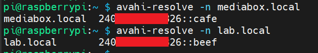
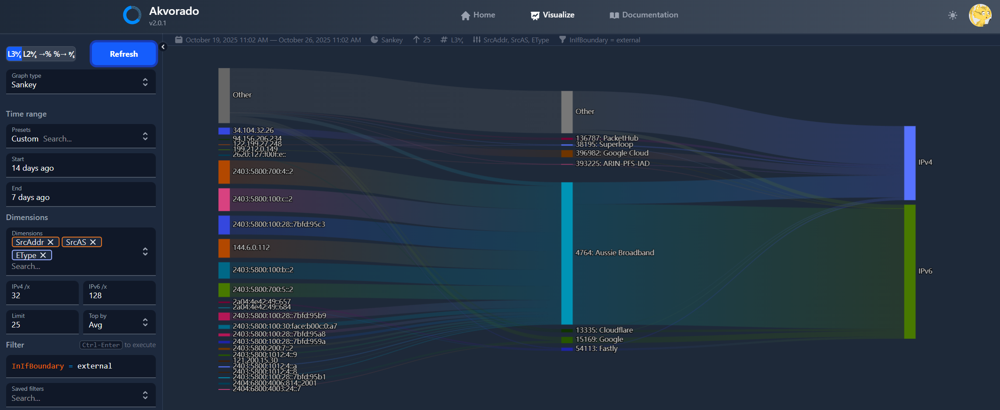
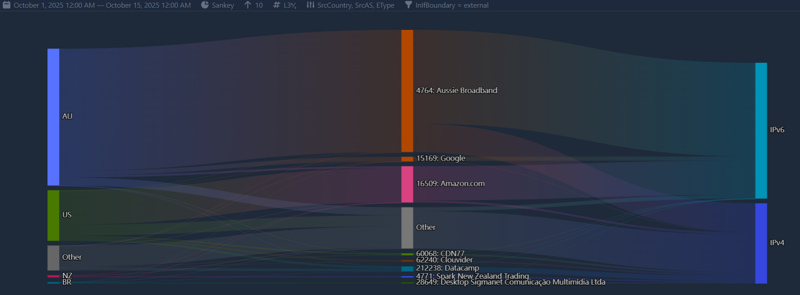
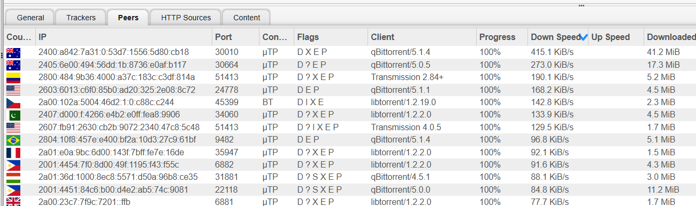
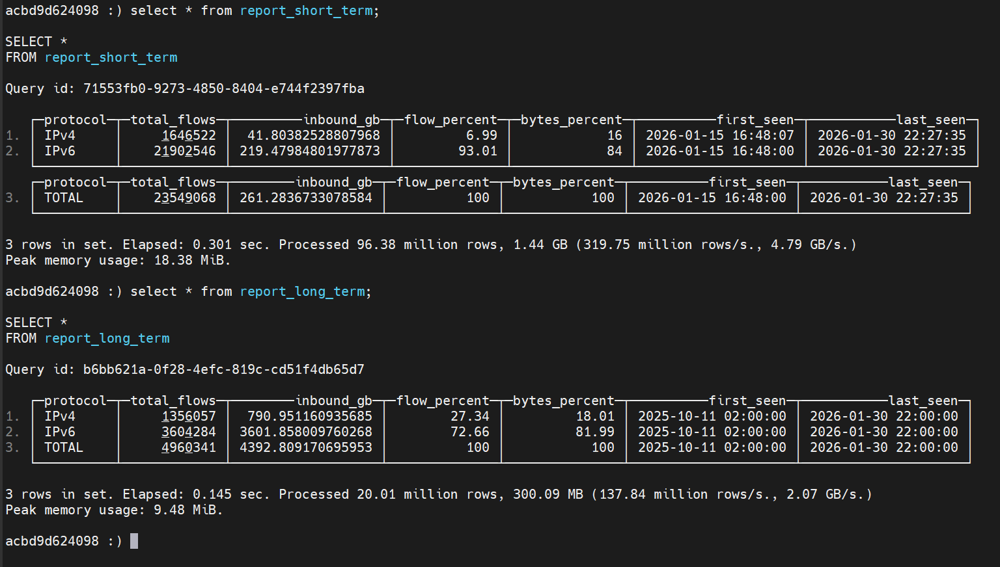
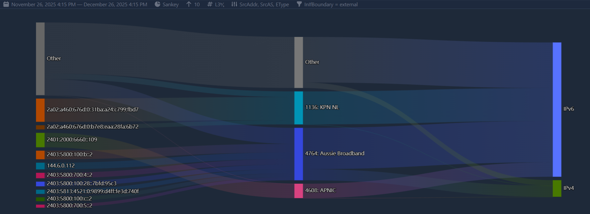
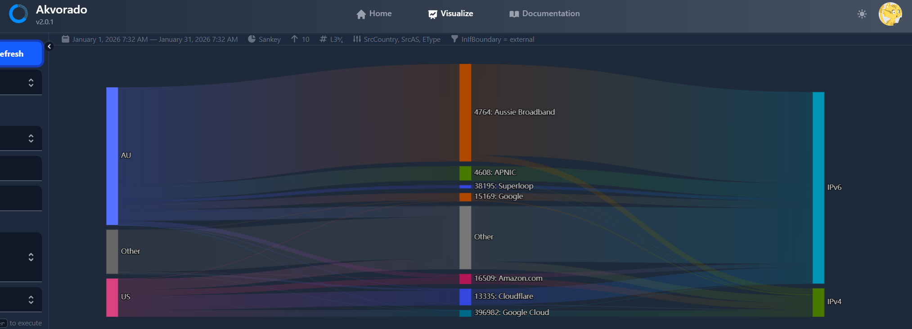
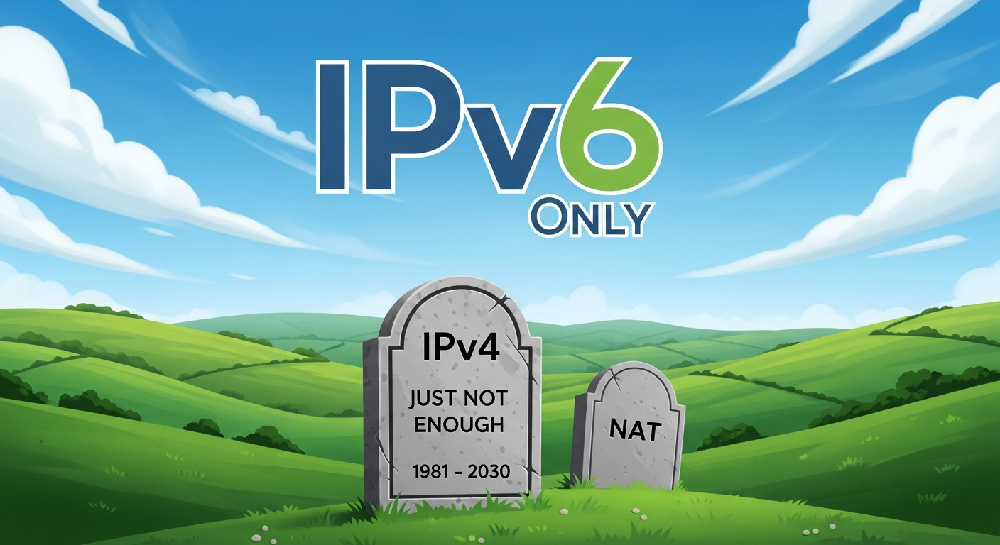

<!-- _class: lead invert -->
<!-- _backgroundImage: url('https://2026.apricot.net/images/ghosted-APRICOT-icon.png') -->

# Project IPv6-First

## A Case Study in Achieving an 80%+ Native IPv6 SOHO Network

**Terry Sweetser**

APNIC IPv6 Deployment

---

## The Objective
**Is a near-native IPv6-first environment achievable today?**

*   **Goal:** Maximize the native IPv6 traffic ratio on a sophisticated SOHO network.
*   **Method:** Data-driven analysis using NetFlow (Akvorado).
*   **Challenge:** Identify and remediate residual IPv4 traffic sources without using transition technologies like CLAT (yet).

---

## The Baseline Environment

Starting from a robust dual-stack foundation:

*   **ISP:** Aussie Broadband (Native IPv6 /48).
*   **Gateway:** MikroTik (RouterOS).
*   **DNS:** Public DNS Resolver 1.1.1.1
*   **Philosophy:** Local services running on planned IPv6 addresses (e.g., `::cafe`, `::beef`).

---

## Data: The Starting Point

*(Ref: Akvorado Sankey Chart)*

---

### The Problem
Despite this "perfect" setup, historical analysis showed the network was only achieving **67.7% IPv6 traffic**.

---

## Methodology: The "Find and Fix" Loop

1.  **Establish Baseline:** Analyze destination ports and protocols via Akvorado.
2.  **Isolate Laggards:** Identify high-bandwidth applications defaulting to IPv4.
3.  **Targeted Intervention:** Reconfigure applications to force IPv6 compliance.
4.  **Validate:** Measure the "After" state.

---

## The First Culprit: BitTorrent

**Initial Status:**
BitTorrent was a significant drag on the network, operating at only **44% IPv6**.

**The "Working" Dual-Stack Trap:**
*   The client was bound to "Any Interface."
*   It accepted IPv4 peer connections from trackers immediately.
*   **Result:** It defaulted to a suboptimal IPv4 NAT path rather than waiting for superior IPv6 peers.

---

## Results: The Shift

**Application Level:**
*   BitTorrent traffic flipped from 44% to **ALL IPv6**.

**Network Level:**
*   The structural change lifted the entire network's stable operational average from ~67% to **>80%**.

> How much would an ISP save on NAT444 at a ratio of 80% ipv6 traffic?

---
<!-- _footer: Torrenting without NAT -->

---

## Local DNS & Happy Eyeballs

The "IPv6-First" success relies on a local DNS stack (Pi-hole + Unbound) that optimizes the **Happy Eyeballs v2 (RFC 8305)** race.

1.  **The "Resolution Delay" (50ms):**
    *   *Standard:* RFC 6724 sees to it that all `AAAA` records are ranked first.
    *   *Local Edge:* Unbound resolves in **microseconds**. The `AAAA` record never arrives "late," so the browser never defaults to IPv4 during lookup.

2.  **The "Connection Head Start" (~250ms):**
    *   Because the IPv6 address is available instantly, the OS starts the IPv6 connection immediately.
    *   It waits **~250ms** before attempting IPv4.
    *   *Result:* IPv6 runs unopposed for a quarter of a second.

**Key Takeaway:** Local DNS resolution removes any "latency penalty" from the race, ensuring IPv6 is not just *preferred*, but mathematically *destined* to win.

---

## Update: Breaking the 90% Barrier

Recent SQL analysis (Dec 7 – Dec 22, 2025) shows continued optimization has pushed the network even further.

| Metric | Long Term (Oct-Dec) | **Short Term (Dec 7-22)** |
| :--- | :---: | :---: |
| Total Flows | 3.3M | 28.1M |
| **IPv6 Bytes %** | 81.19% | **90.74%** |

> The network is now operating as an effectively IPv6-Native environment.

---

## Storing the Data

*(Ref: Clickhouse SQL Analysis confirming >90% IPv6 Netflow ratio)*

---

## Visualizing the Data

*(Ref: Akvorado Sankay Charts)*

---

## Macro vs. Micro: Validating the Data

My SOHO network mirrors global adoption curves, suggesting that **~80%** is the current "natural limit" for standard dual-stack implementation.

| Context | IPv6 Ratio | Status |
| :--- | :---: | :--- |
| **Germany** (National) | **66.67%** | Strong legacy infrastructure drag |
| **My Network** (Baseline) | **67.70%** | Default configs favoring IPv4 |
| **India** (National) | **78.90%** | Mobile-first / Greenfields architecture |
| **France** (National) | **79.23%** | Aggressive ISP migration |
| **My Network** (Optimized) | **79.20%** | Active deprecation of IPv4 paths |
| **My Network** (Dec '25) | **90.74%** | **The "IPv6-Native" Frontier** |

**Key Insight:**
*We can manually achieve today what the global internet would naturally reach in ~5 years.*

---

## Defining the "IPv4 Floor"

The remaining ~10% of IPv4 traffic is irreducible without CLAT/NAT64. It consists of:

1.  **Legacy IoT:** Ring cameras (IPv4-only video upload).
2.  **Legacy Web Services:** 
    *   Amazon.com (Main retail site).
    *   GitHub.com (Main site, though assets are v6).
3.  **ISP Infrastructure:** Aussie Broadband caching/accelerators.

> Or we can wait for these services to deploy ipv6 ...

---

## DNS-Aware Dynamic EAM "The Idea"

Standard 464XLAT double-translates traffic (IPv4 $\to$ IPv6 $\to$ IPv4).
For the "Ring Camera" problem (IPv4 device $\to$ IPv6 API), we can do better.

**The Prototype: Unbound + Jool (SIIT)**
I am proposing a dynamic extension to **RFC 7757 (EAM)**:
1.  **Detect:** Daemon monitors local DNS (Unbound) for `A` + `AAAA` pairs.
2.  **Map:** Dynamically populates the SIIT translator table.
3.  **Result:** Legacy IPv4 devices connect **directly** to IPv6 APIs.

> **Impact:** This removes the "Vendor Negligence" traffic (e.g., Ring) from the IPv4 floor without waiting for firmware updates.

---

## A Call to Action

We need 464XLAT on more platforms, including PLAT and CLAT on Mikrotik.

### 📢 We Need Your Voice
Support Feature Request **#263487** to bring native 464XLAT to RouterOS.

**[forum.mikrotik.com/t/feature-request-464xlat/263487](https://forum.mikrotik.com/t/feature-request-464xlat/263487)**

---

## January 2026 Data

---

## Acknowledgement

https://vaibhavbajpai.com/publications-by-year.html

The research of Prof Vaibhav Bajpai and his teams.

https://scholar.google.com.au/citations?user=ksAaiuUAAAAJ&hl=en&oi=ao

---

> So, yes, we can live without ipv4 ... 

https://bit.ly/3L4clnw

